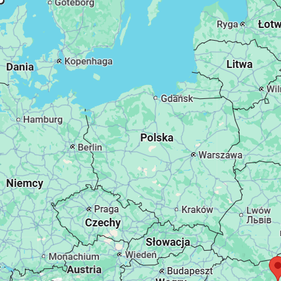
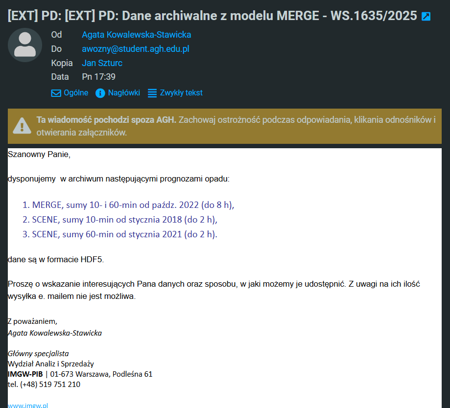

# Dane z modeli prognozy pogody

## Dane dostępne na stronie [danepubliczne.imgw.pl](https://danepubliczne.imgw.pl/pl/datastore):
- dane z modelu ALARO od 2018 roku co 6 godzin (GRIB)
- dane z modelu AROME od 2018 roku co 6 godzin (GRIB)
  
Oba zbiory danych pokrywają według metadanych bardzo dużą część Europy centralnej, więc powierzchnia nie stanowi ograniczenia (zwłaszcza, że tak na prawdę ograniczamy się do okolic kilku deszczomierzy). Głównym problemem w przypadku tych zbiorów jest bardzo niska częstotliwość pomiarów, która daje ok 10k pomiarów w jednym obszarze (4 * 365 * 7). Dodatkowo dosyć łatwo wczytać i pracować na tych danych w Pythonie 

```python
ds=xr.open_dataset('data/fc20231229_00+000gl',engine='cfgrib', filter_by_keys={'typeOfLevel': 'meanSea'})
```


## Dane zaproponowane po kontakcie z IMGW:
Skontaktowaliśmy się z IMGW z prośbą o udostępnienie danych z modeli o krótszej prognozie, ale o większej częstotliwości prognozy jak n.p. MERGE. Dostaliśmy takie propozycje dla Małopolski. Ustaliliśmy, że dane zostaną załodowane na _Sharepoint_.



# Aktualne publikacje na temat modelowania&symulowania pogody oraz predykcji opadów

- [Hydrologically informed machine learning for rainfall–runoff modelling: towards distributed modelling](http://hess.copernicus.org/articles/25/4373/2021/hess-25-4373-2021.html)
  - Artykuł opisuje proces powstawania narzędzia MIKA - SHA, służacego do atomatycznego tworzenia modeli
  - Skupia sie na budowie modeli pół rozporoszonych (dzielą obszar na dość grube siatki i w każda komórka jest traktowana oddzielnie)
  - Przy użyciu algorytmów genetycznych i algorytmów uczenia maszynowego dobierana jest najlepsza kombinacja (pod względem wielu kryteriów) modeli prognozy pogody, tak żeby uzyskać jak najbardziej obiektywny i dokładny model w danym punkcie
  - Optymalizowane miary szeregów czasowych:
    - Standardized Signature Index Sum
    - Cross-Sample Entropy
    - Dynamic Time Warping
  - Każda z tych miar określa czy wymodelowany wynikowy szereg czasowy jest dobrze zgeneralizowany

- [Methods to improve run time of hydrologic models: opportunities and challenges in the machine learning era](https://arxiv.org/pdf/2408.02242)
  - Artykuł opisuje trudności na jakie można się napotkać w przypadku wykorzystania uczenia maszynowego do modelowania hydrologicznego.
  - Jest to średniej jakości artykuł przeglądowy, który jednak zrobił już wstępny przegląd literatury, dzięki czemu przeglądając cytowania oraz cytowania cytowań można znaleźć inne ciekawe publikacje takie jak:
    - [Towards Learning Universal, Regional, and Local Hydrological
Behaviors via Machine-Learning Applied to Large-Sample Datasets](https://arxiv.org/pdf/1907.08456) - Porównanie różnych modeli głębokich sieci neuronowych do prognozowania opadów
    - [An extensive evaluation of seven machine learning methods for
rainfall prediction in weather derivatives](https://www.kampouridis.net/papers/ESWA2017-AcceptedManuscript.pdf) - Porównanie różnych modeli uczenia maszynowego do prognozowania opadów. Benchmark niestety wykorzystuje dane dzienne, w związku z powyższym odbiega on trochę od częśtotliwości oczekiwanej przez ten projekt. Jednocześnie wskazuje to, że ten projekt w celuje w dosyć niezbadaną dziedzinę, ponieważ deszcze krótkoterminowe są zdecydowanie bardziej zmienne i nieprzewidywalne niż opady na przestrzeni całego dnia.
    


# Dane z deszczomierzy

IMGW udostępnia dane z deszczomierzy w formacie CSV. W tym przypadku mamy do dyspozycji dane od 1951 do 2023 roku włącznie. Problematyczna jest dokładność tych pomiarów, ponieważ są to dane co najwyżej dzienne. Dane możemy znaleźć na stronie [danepubliczne.imgw.pl](https://danepubliczne.imgw.pl/data/dane_pomiarowo_obserwacyjne/dane_hydrologiczne/dobowe/)

Drugim źródłem danych są dane jest **Polski Atlas Natężeń Deszczów (PANDa)** -> [link](https://atlaspanda.pl/#). Na stronie jest wspomniane, że podstawą dla platformy są dane opadowe z trzech dekad przy użyciu 100 deszczomierzy, to niestety nie widać aby były one ogólno dostępne. Po zalogowaniu na ich platformę, można zapłacić za dostęp do predykcji, lecz i tam danych również brak. Na stronie internetowej uwzględniają oni współpracę z uczelniami przez specjalny formularz kontaktowy. Możliwe, że udałoby się uzyskać dostęp do tych danych w ramach współpracy z uczelnią. Aktualnie jesteśmy na etapie oczekiwania na odpowiedź.

