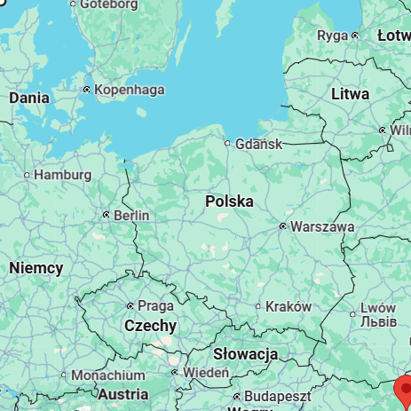
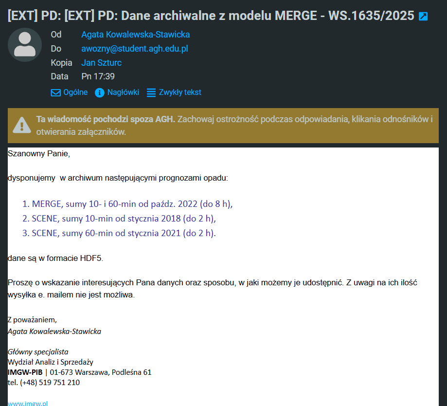

# Dane z modeli prognozy pogody

## Dane dostępne na stronie [danepubliczne.imgw.pl](https://danepubliczne.imgw.pl/pl/datastore):
- dane z modelu ALARO od 2018 roku co 6 godzin (GRIB)
- dane z modelu AROME od 2018 roku co 6 godzin (GRIB)
  
Oba zbiory danych pokrywają według metadanych bardzo dużą część Europy centralnej, więc powierzchnia nie stanowi ograniczenia (zwłaszcza, że tak na prawdę ograniczamy się do okolic kilku deszczomierzy). Głównym problemem w przypadku tych zbiorów jest bardzo niska częstotliwość pomiarów, która daje ok 10k pomiarów w jednym obszarze (4 * 365 * 7). Dodatkowo dosyć łatwo wczytać i pracować na tych danych w Pythonie 

```python
ds=xr.open_dataset('data/fc20231229_00+000gl',engine='cfgrib', filter_by_keys={'typeOfLevel': 'meanSea'})
```


## Dane zaproponowane po kontakcie z IMGW:
Skontaktowaliśmy się z IMGW z prośbą o udostępnienie danych z modeli o krótszej prognozie, ale o większej częstotliwości prognozy jak n.p. MERGE. Dostaliśmy takie propozycje dla Małopolski. Ustaliliśmy, że dane zostaną załodowane na _Sharepoint_.



# Aktualne publikacje na temat modelowania&symulowania pogody oraz predykcji opadów

- [Hydrologically informed machine learning for rainfall–runoff modelling: towards distributed modelling](http://hess.copernicus.org/articles/25/4373/2021/hess-25-4373-2021.html)
  - Artykuł opisuje proces powstawania narzędzia MIKA - SHA, służacego do atomatycznego tworzenia modeli
  - Skupia sie na budowie modeli pół rozporoszonych (dzielą obszar na dość grube siatki i w każda komórka jest traktowana oddzielnie)
  - Przy użyciu algorytmów genetycznych i algorytmów uczenia maszynowego dobierana jest najlepsza kombinacja (pod względem wielu kryteriów) modeli prognozy pogody, tak żeby uzyskać jak najbardziej obiektywny i dokładny model w danym punkcie
  - Optymalizowane miary szeregów czasowych:
    - Standardized Signature Index Sum
    - Cross-Sample Entropy
    - Dynamic Time Warping
  - Każda z tych miar określa czy wymodelowany wynikowy szereg czasowy jest dobrze zgeneralizowany


# Dane z deszczomierzy